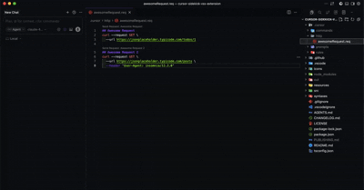

<div align="center">

# 🎮 CursorToys

### The Ultimate Productivity Toolkit for Cursor AI

**Supercharge your workflow** • **Test APIs in-editor** • **Share instantly** • **Collaborate effortlessly**

[](https://marketplace.visualstudio.com/items?itemName=Godrix.cursor-toys)
[](LICENSE)
[](https://marketplace.visualstudio.com/items?itemName=Godrix.cursor-toys)
[](https://open-vsx.org/extension/godrix/cursor-toys)

[Installation](#-quick-start) • [Features](#-features) • [Configuration](#-configuration) • [Support](#-support)

</div>

---

## 🎯 What is CursorToys?

**CursorToys** transforms Cursor AI into a **collaborative powerhouse**. Share AI configurations instantly, test APIs without leaving your editor, optimize files and clipboard content, and build reusable command libraries that work across all your projects.

> **Stop context-switching.** Everything you need to maximize Cursor AI productivity, in one extension.

### Why Developers Love It

```
✨ One-click sharing     → No more copy-pasting commands
🚀 In-editor API testing → Zero external tools, environment variables support
📚 Personal libraries    → Reusable across all projects
👥 Team collaboration    → Sync AI configs instantly
🗜️ File optimization    → Minify JSON, HTML, CSS, JS instantly
📋 Smart clipboard      → Auto-detect and optimize clipboard content
```

---

## 🎬 See It In Action

<table>
<tr>
<td width="50%">

### 🔗 Share Commands Instantly

*Generate shareable links with one click*

</td>
<td width="50%">

### 📥 Import Configurations

*Import team configs in seconds*

</td>
</tr>
<tr>
<td colspan="2">

### 📚 Personal Command Library

*Visual tree view for all your commands and prompts*

</td>
</tr>
</table>

---

## ✨ Features

### 🔗 Instant Sharing & Collaboration

**Share AI configurations in one click** — No more screenshots or copy-pasting.

- 🎯 **One-Click Share Links** — Convert commands, rules, and prompts to shareable deeplinks or CursorToys format
- ⌨️ **Fast Import** — `Cmd+Shift+I` to import from any link (deeplink, CursorToys, or GitHub Gist)
- 🔄 **Multiple Formats** — Deeplink, web URL, CursorToys compressed format, or GitHub Gist
- 👥 **Team Sync** — Everyone uses the same AI instructions
- 📦 **CursorToys Format** — New compressed format ideal for large files (no URL length limits)
- 🌐 **GitHub Gist Integration** — Share via Gist for maximum compatibility and discoverability

### 📓 Project Documentation

**Build project-specific documentation** — Notepads that stay with your project.

- 📝 **Project Notepads** — Workspace-specific markdown notes in `.cursor/notepads/`
- 🗂️ **Visual Tree View** — Browse and manage notepads in Explorer sidebar
- 📂 **Hierarchical Organization** — Organize notepads in subfolders with drag-and-drop
- ✏️ **Easy Management** — Create, rename, delete, and reveal notepads
- 🔗 **Shareable** — Generate CursorToys shareables or Gist for individual notepads or entire folders
- 🎯 **Drag & Drop** — Move notepads between folders easily
- 🔄 **Auto-Refresh** — File system watchers keep tree view in sync

### 🌐 In-Editor API Testing

**Test APIs without leaving Cursor** — Full REST client built-in.

- 🚀 **Execute Requests** — Run HTTP requests from `.req` files with CodeLens
- 📝 **Multiple Formats** — cURL commands or structured JSON
- ⚡ **Performance Tracking** — See execution time for each request
- 🎨 **Syntax Highlighting** — Beautiful highlighting for requests and responses
- 🌍 **Environment Variables** — Use `{{variableName}}` for dynamic values
- 🔧 **Multiple Environments** — Switch between dev, staging, prod instantly
- 💾 **Auto-Save Responses** — Or preview-only mode for quick tests

### 📚 Personal Command Libraries

**Build reusable libraries** — Commands that work across all projects.

- 🗂️ **Visual Tree View** — Browse all personal commands and prompts in Explorer sidebar
- 🏠 **Personal + Project** — Separate libraries for personal and project-specific
- ✏️ **Easy Management** — Rename, delete, reveal in folder
- 🔍 **Smart Filtering** — Filter by file extensions
- 📂 **Hierarchical Folders** — Organize in subfolders with drag-and-drop
- 🎯 **Drag & Drop** — Move commands/prompts between folders easily

### 🗜️ File Minification & Optimization

**Optimize files and clipboard content** — Reduce file sizes instantly.

- 📦 **Minify Files** — One-click minification for JSON, HTML, XML, CSS, SVG, JS, TS
- 📋 **Clipboard Minification** — Minify clipboard content with auto-detection
- 📊 **Statistics** — See original size, minified size, and savings percentage
- ⚙️ **Configurable** — Customize output suffix and behavior
- 🎯 **Context Menu** — Right-click any supported file → Minify File

### 💬 Chat Integration

**Send code to Cursor AI faster** — No manual copy-paste.

- ✂️ **Send Selection** — Right-click → Send to Chat
- 🔗 **Prompt Deeplinks** — Generate shareable prompt links from selected code
- 📝 **Custom Text** — Send any text directly to chat
- 📍 **Context Included** — File path, language, and line numbers auto-added

---

## 🚀 Quick Start

### Installation

**Option 1: VS Code Marketplace** (Recommended)
- [VS Code Marketplace](https://marketplace.visualstudio.com/items?itemName=Godrix.cursor-toys)
- [Open VSX Registry](https://open-vsx.org/extension/godrix/cursor-toys) (for Cursor and other editors)

**Option 2: Manual Installation**
1. Download the latest `.vsix` from [GitHub Releases](https://github.com/godrix/cursor-toys/releases)
2. Open Cursor/VS Code
3. Go to Extensions (`Cmd+Shift+X`)
4. Click `...` → `Install from VSIX...`
5. Select the downloaded file

### First Steps

1. **Open Command Palette** (`Cmd+Shift+P`)
2. Type **"CursorToys"** to see all available commands
3. Try **"CursorToys: Generate Share Link"** on a command file
4. Press **`Cmd+Shift+I`** to import a shared link

---

## 📖 Usage Examples

### 🔗 Sharing Commands

**Right-click any command file** → Choose your preferred sharing format:

#### Option 1: Deeplink Format (Traditional)
**Best for:** Direct sharing in Slack, Discord, or platforms with URL length support

```bash
# Deeplink copied to clipboard!
cursor://godrix.cursor-toys/command?text=...

# Or web format
https://cursor.com/link/command?text=...
```

**Limitation:** Maximum 8,000 characters (URL-encoded)

#### Option 2: CursorToys Format (New in v1.1)
**Best for:** Large files or when deeplinks exceed length limit

```bash
# CursorToys shareable copied to clipboard!
cursortoys://COMMAND:filename:compressedData...
```

**Advantages:**
- ✅ No URL length limit (uses gzip compression + base64)
- ✅ Ideal for large commands, rules, and prompts
- ✅ Smaller size (60-80% compression ratio)
- ✅ Faster to share and import

**Send to team** → They press `Cmd+Shift+I` → Command imported ✨

**Note:** The extension automatically detects the format when importing.

### 🌐 HTTP Request Testing

**Create a `.req` file** in `.cursor/http/`:

```http
## Get Users
GET {{BASE_URL}}/api/users
Authorization: Bearer {{API_TOKEN}}

## Create User  
POST {{BASE_URL}}/api/users
Content-Type: application/json

{
  "name": "John Doe",
  "email": "john@example.com"
}
```

**Set up environment variables** in `.cursor/http/environments/.env.dev`:

```env
BASE_URL=http://localhost:3000
API_TOKEN=your-dev-token-here
```

**Click CodeLens "Send Request"** → Variables replaced → Response appears instantly! ⚡

### 🗜️ Minify Files

**Optimize any file with one click:**

```bash
# Right-click any JSON, HTML, XML, CSS, SVG, JS, or TS file
→ "Minify File"
→ Creates file.min.ext with optimized content
```

**Or minify clipboard content:**

```bash
# Copy large JSON/HTML/CSS to clipboard
Cmd+Shift+P → "Trim & Minify Clipboard"
→ Clipboard optimized automatically!
```

**Statistics shown:** `Savings: 15.3KB (68.2%) | Original: 22.4KB → Minified: 7.1KB`

### 📚 Personal Commands

Your personal commands in `~/.cursor/commands/` appear in the sidebar:

```
📁 Personal Commands
  ├─ 📄 code-review.md
  ├─ 📄 refactor-helper.md
  └─ 📄 bug-analyzer.md
```

**Right-click** → Generate link, rename, delete, or reveal in folder.

---

## ⚙️ Configuration
- Send selected code directly to Cursor chat
- Custom text injection for faster context building
- Streamlined AI interaction workflow

## 🚀 Installation

### Quick Install (Recommended)

**For Cursor/VS Code:**
- Open Extensions (`Cmd+Shift+X` / `Ctrl+Shift+X`)
- Search for **"Cursor Command Toys"**
- Click Install

**Direct Links:**
- [VS Code Marketplace](https://marketplace.visualstudio.com/items?itemName=Godrix.cursor-toys)
- [Open VSX Registry](https://open-vsx.org/extension/godrix/cursor-toys) (for Cursor and other editors)

### Manual Install

1. Download the latest `.vsix` from [GitHub Releases](https://github.com/godrix/cursor-toys/releases)
2. Open Command Palette (`Cmd+Shift+P` / `Ctrl+Shift+P`)
3. Run **"Extensions: Install from VSIX..."**
4. Select the downloaded file

**That's it!** The extension is ready to enhance your Cursor experience.

## 📖 Quick Start Guide

### 🎯 **Get Started in 60 Seconds**

**Step 1: Test an API (30 seconds)**
```bash
# Create .cursor/http/api-test.req in your project
curl -X GET https://api.github.com/users/octocat
```
Click the "Send Request" link that appears above → See formatted response!

**Step 2: Share a Command (20 seconds)**
1. Create `.cursor/commands/my-command.md`
2. Right-click → "Generate Cursor Toys Command"
3. Link copied! Share it anywhere.

**Step 3: Import Team Config (10 seconds)**
1. Press `Cmd+Shift+I` (Mac) or `Ctrl+Shift+I` (Windows/Linux)
2. Paste a deeplink
3. Done! File created automatically.

### 🎯 **Daily Workflow Scenarios**

#### Scenario 1: Testing an API Endpoint
1. Create `.cursor/http/api-test.req` in your project
2. Write your curl command or JSON request
3. Click the "Send Request" CodeLens link
4. View formatted response with execution time

#### Scenario 2: Sharing a Team Command
1. Create your command in `.cursor/commands/`
2. Right-click → "Generate Cursor Toys Command"
3. Share the link in your team chat
4. Team members import with `Cmd+Shift+I`

#### Scenario 3: Building a Personal Command Library
1. Use the Personal Commands tree view
2. Save frequently used commands as personal commands
3. Access them from any project instantly
4. Organize and manage your AI command collection

## 🤝 Detailed Usage: Share and Import

### Generating Share Links


#### Method 1: Context Menu (Recommended for Quick Generation)

1.  Navigate to the configuration file you wish to share:
      * `.cursor/commands/` or `.claude/commands/` (for Commands)
      * `.cursor/rules/` (for Rules)
      * `.cursor/prompts/` (for Prompts)
2.  **Right-click** the file and select the specific **"Generate Cursor Toys..."** option (e.g., "Generate Cursor Toys Command").
3.  The share link will be **automatically copied to your clipboard**.

#### Method 2: CodeLens (Direct In-File Access)

1.  Open any file in `.cursor/commands/`, `.claude/commands/`, `.cursor/rules/`, or `.cursor/prompts/`.
2.  Click the CodeLens link displayed at the top of the file.
3.  The deeplink will be generated and copied.

### Importing Shared Links


#### Method 1: Keyboard Shortcut

1.  Press **`Ctrl+Shift+I`** (Windows/Linux) or **`Cmd+Shift+I`** (Mac).
2.  Paste the deeplink into the input box.
3.  For **commands**, choose where to save:
    - **Project commands**: Save to `.cursor/commands/` or `.claude/commands/` in the current workspace (based on configuration, project-specific)
    - **Personal commands**: Save to `~/.cursor/commands/` or `~/.claude/commands/` (based on configuration, available in all projects)
4.  The file will be **automatically created and imported** into the appropriate directory.

#### Method 2: Command Palette

1.  Press `Cmd+Shift+P` (Mac) or `Ctrl+Shift+P` (Windows/Linux).
2.  Type **"Import Cursor Toys"**.
3.  Paste the deeplink, and for commands, choose the save location.
4.  The file will be created.

### Saving Commands as User Commands

You can move existing project commands to your personal commands folder so they're available across all projects:

1.  Right-click on any file in `.cursor/commands/` or `.claude/commands/` folder.
2.  Select **"Cursor Toys"** submenu.
3.  Choose **"Save as User Command"**.
4.  The command will be copied to `~/.cursor/commands/` or `~/.claude/commands/` (based on your configuration) and you'll be asked if you want to remove the original file from the workspace.

## 🌐 HTTP Request Execution

**Test APIs without leaving your editor.** Execute HTTP requests directly from your workspace with full syntax highlighting, automatic response formatting, and performance tracking.

### Visual Demo


### Creating HTTP Request Files

**Important**: HTTP request files must be located in the `.cursor/http/` folder (or subfolders within it) to be recognized by the extension.

Create files with `.req` or `.request` extension in `.cursor/http/` containing your HTTP requests in one of two formats:

#### Format 1: Curl Command
```bash
curl -X POST https://api.example.com/users \
  -H "Content-Type: application/json" \
  -H "Authorization: Bearer token123" \
  -d '{"name": "John Doe", "email": "john@example.com"}'
```

#### Format 2: Structured JSON
```json
{
  "method": "POST",
  "url": "https://api.example.com/users",
  "headers": {
    "Content-Type": "application/json",
    "Authorization": "Bearer token123"
  },
  "body": {
    "name": "John Doe",
    "email": "john@example.com"
  }
}
```

### Executing Requests

#### Method 1: CodeLens (Recommended)
1. Open any `.req` or `.request` file in `.cursor/http/` folder
2. Click the **"Send Request"** link that appears above the request (or above each section if you have multiple requests)
3. The request will be executed and the response will be displayed

#### Method 2: Command Palette
1. Open any `.req` or `.request` file in `.cursor/http/` folder
2. Press `Cmd+Shift+P` (Mac) or `Ctrl+Shift+P` (Windows/Linux)
3. Type **"CursorToys: Send HTTP Request"** and select it
4. The request will be executed

**Note**: Files must be in `.cursor/http/` (or subfolders) to be recognized. The extension will not show CodeLens links for `.req` files outside this folder.

### Multiple Requests in One File

You can organize multiple requests in a single file using markdown sections. Create the file in `.cursor/http/`:

```markdown
## Get User
curl -X GET https://api.example.com/users/123 \
  -H "Authorization: Bearer token123"

## Create User
curl -X POST https://api.example.com/users \
  -H "Content-Type: application/json" \
  -H "Authorization: Bearer token123" \
  -d '{"name": "John Doe"}'
```

Each section will have its own "Send Request" CodeLens link, allowing you to execute requests individually.

### File Location Requirements

**HTTP request files must be located in:**
- `.cursor/http/` (root level)
- `.cursor/http/subfolder/` (any subfolder)

**Supported file extensions:**
- `.req`
- `.request`

**Example file structure:**
```
project/
  .cursor/
    http/
      api-tests.req
      auth/
        login.request
      users.req
```

### Response Files

When a request is executed:
- **If `httpRequestSaveFile` is `true`**: The response is saved to a `.res` or `.response` file (same name as request file, with response extension)
- **If `httpRequestSaveFile` is `false`**: The response is shown in a preview tab (not saved to disk)

Response files include:
- HTTP status code and status text
- Response headers
- Formatted response body (JSON and XML are automatically formatted)
- Execution time in the file name/title

### Configuration

Configure HTTP request behavior in your settings:

```json
{
  "cursorToys.httpRequestTimeout": 10,
  "cursorToys.httpRequestSaveFile": false
}
```

- **`cursorToys.httpRequestTimeout`**: Timeout in seconds for HTTP requests (default: 10 seconds)
- **`cursorToys.httpRequestSaveFile`**: Save HTTP response to file. If `false`, only shows preview without saving (default: `false`)

### Requirements

- **curl**: The extension uses `curl` command-line tool to execute requests. Make sure `curl` is installed and available in your system PATH.

## 📓 Project Notepads

**Document your project directly in your workspace** — Project-specific markdown notes that stay with your code.

### What are Project Notepads?

Project Notepads are workspace-specific markdown notes stored in `.cursor/notepads/` (or `.vscode/notepads/` if you've configured a different base folder). Unlike Personal Commands/Prompts that are available across all projects, notepads are tied to the current workspace.

**Perfect for:**
- 📋 Project documentation
- 🏗️ Architecture decisions
- 📝 Development guides
- 🐛 Bug investigation notes
- 💡 Feature planning
- 📖 Onboarding documentation

### Creating and Managing Notepads

#### Visual Demo

*Similar tree view experience for managing notepads*

#### Method 1: Tree View (Recommended)

1. **Open Project Notepads View** in Explorer sidebar
2. **Click the "+" icon** to create a new notepad
3. **Enter notepad name** (e.g., "architecture-decisions")
4. **Start writing** — File created with markdown template

#### Method 2: Manual Creation

1. Create a `.cursor/notepads/` folder in your workspace
2. Add `.md` or `.mdc` files
3. Files automatically appear in the Project Notepads tree view

### Organizing Notepads

**Hierarchical Folder Structure:**

```
project/
  .cursor/
    notepads/
      architecture/
        decisions.md
        diagrams.md
      guides/
        setup.md
        deployment.md
      investigations/
        bug-123.md
        performance.md
```

**Drag and Drop:**
- Drag notepads between folders
- Move files to organize documentation
- Tree view updates automatically

### Sharing Notepads

#### Share Single Notepad
1. Right-click notepad in tree view
2. Select **"CursorToys: Share Notepad"**
3. Choose format:
   - **CursorToys Format** — Compressed shareable
   - **GitHub Gist** — Share via Gist (see below)
4. Share link with team

#### Share Notepad Folder
1. Right-click on `.cursor/notepads/` folder
2. Select **"CursorToys: Share Folder as CursorToys (Notepads Bundle)"**
3. Entire documentation bundle copied to clipboard
4. Team members import with `Cmd+Shift+I`

### Import Notepads

**Import Single Notepad:**
1. Press `Cmd+Shift+I` (Mac) or `Ctrl+Shift+I` (Windows/Linux)
2. Paste notepad shareable
3. Notepad created in workspace `.cursor/notepads/` folder

**Import Notepad Bundle:**
1. Press `Cmd+Shift+I`
2. Paste bundle URL
3. All notepads imported with folder structure preserved

### Use Cases

#### Use Case 1: Architecture Documentation
**Problem**: Architecture decisions scattered in Slack, docs, and comments.

**Solution**:
1. Create `architecture/` folder in notepads
2. Document each decision in separate notepad
3. Share folder as bundle when onboarding new members
4. Keep documentation version-controlled with code

#### Use Case 2: Bug Investigation Notes
**Problem**: Debugging notes lost after resolving issues.

**Solution**:
1. Create notepad for each investigation
2. Document findings, attempts, and solution
3. Share notepad when asking for help
4. Reference later when similar issues occur

#### Use Case 3: Team Onboarding
**Problem**: New team members don't know where to start.

**Solution**:
1. Create comprehensive onboarding notepads
2. Include setup guides, conventions, and tips
3. Share notepad bundle in onboarding documentation
4. New members have everything they need locally

## 🌐 GitHub Gist Integration

**Share via GitHub Gist** — Maximum compatibility, discoverability, and browser viewing.

### Why Share via Gist?

- ✅ **Browser Viewing** — Recipients can view without importing
- ✅ **Maximum Compatibility** — Works with any editor, not just Cursor
- ✅ **Public or Private** — Control visibility of shared content
- ✅ **Permanent Links** — Gists stay accessible on GitHub
- ✅ **Discoverable** — Public gists searchable on GitHub
- ✅ **Version History** — GitHub tracks gist changes
- ✅ **Embedded Viewing** — Gists can be embedded in docs

### Setting Up GitHub Token

**Required for creating Gists:**

1. **Create Personal Access Token**:
   - Go to GitHub → Settings → Developer settings → Personal access tokens
   - Generate new token (classic)
   - Select scope: `gist` (required)
   - Copy token (starts with `ghp_` or `github_pat_`)

2. **Configure Token in CursorToys**:
   - Open Command Palette (`Cmd+Shift+P`)
   - Run **"CursorToys: Configure GitHub Token"**
   - Paste your token
   - Token stored securely in VS Code Secrets

**Note**: Token stored securely using VS Code Secrets API. Not visible in settings or files.

### Sharing via Gist

#### Share Single File

1. **Right-click any file** in:
   - `.cursor/commands/`
   - `.cursor/rules/`
   - `.cursor/prompts/`
   - `.cursor/notepads/`
   - `.cursor/http/` (request files)
   - `.cursor/http/environments/` (environment files)

2. **Select** → **"CursorToys: Share via GitHub Gist"**

3. **Choose visibility**:
   - **Public** — Anyone can see (searchable)
   - **Private** — Only you can see (unlisted)
   - Or configure default in settings

4. **Gist created** — URL copied to clipboard

5. **Share URL** — Recipients can:
   - View in browser
   - Import with `Cmd+Shift+I` in Cursor

#### Share Folder as Gist Bundle

1. **Right-click folder**:
   - `.cursor/commands/`
   - `.cursor/rules/`
   - `.cursor/prompts/`
   - `.cursor/notepads/`
   - `.cursor/http/`
   - `.cursor/` (entire project)

2. **Select** → **"CursorToys: Share Folder via GitHub Gist"**

3. **Choose visibility** (public or private)

4. **Gist bundle created** with all files

5. **Share URL** — Team gets entire folder structure

### Importing from Gist

**Method 1: Via Import Command**

1. Press **`Cmd+Shift+I`** (Mac) or **`Ctrl+Shift+I`** (Windows/Linux)
2. Paste Gist URL or ID:
   - Full URL: `https://gist.github.com/username/abc123`
   - Raw URL: `https://gist.githubusercontent.com/username/abc123/raw/...`
   - Just ID: `abc123...`
3. Files imported to appropriate folders automatically

**Method 2: Browser to Import**

1. Find CursorToys Gist on GitHub
2. Click **"Raw"** or copy URL
3. Import in Cursor with `Cmd+Shift+I`

### Gist Configuration

```json
{
  // Default visibility when creating Gists
  "cursorToys.gistDefaultVisibility": "ask"
}
```

**Options:**
- `"ask"` — Prompt each time (default)
- `"public"` — Always create public gists
- `"private"` — Always create private gists

### Gist Metadata

CursorToys embeds metadata in Gists for validation:

```json
{
  "cursortoys": {
    "version": "1.3.0",
    "type": "command",
    "created": "2026-01-01T12:00:00.000Z",
    "fileCount": 1,
    "files": [
      {
        "name": "my-command.md",
        "type": "command",
        "size": 1234
      }
    ]
  }
}
```

**Benefits:**
- ✅ Validates Gist format on import
- ✅ Identifies file types automatically
- ✅ Provides bundle information
- ✅ Ensures CursorToys compatibility

### Gist vs CursorToys vs Deeplink

| Feature | Deeplink | CursorToys | GitHub Gist |
|:--------|:---------|:-----------|:------------|
| **Max Size** | 8KB (URL limit) | No limit (compressed) | 100MB |
| **Browser Viewing** | ❌ No | ❌ No | ✅ Yes |
| **Requires Import** | ✅ Yes | ✅ Yes | 🟡 Optional |
| **Public Discovery** | ❌ No | ❌ No | ✅ Yes (public gists) |
| **Version History** | ❌ No | ❌ No | ✅ Yes |
| **Permanent Link** | ✅ Yes | ✅ Yes | ✅ Yes |
| **Compression** | None | 60-80% | None |
| **Best For** | Quick sharing | Large files | Public sharing, documentation |

**When to use each:**
- **Deeplink** — Quick team sharing, small files
- **CursorToys** — Large files, bypassing URL limits
- **GitHub Gist** — Public sharing, browser viewing, permanent documentation

### Gist Management Commands

| Command | Description |
|:--------|:------------|
| CursorToys: Configure GitHub Token | Set up GitHub Personal Access Token |
| CursorToys: Remove GitHub Token | Remove stored token |
| CursorToys: Share via GitHub Gist | Share single file as Gist |
| CursorToys: Share Folder via GitHub Gist | Share folder as Gist bundle |

### Gist Examples

#### Example 1: Public Command Library
1. Create useful commands in `.cursor/commands/`
2. Right-click folder → Share via GitHub Gist → Public
3. Share gist URL in community forums
4. Others discover and import your commands

#### Example 2: Team API Setup
1. Configure HTTP requests and environments
2. Right-click `.cursor/http/` → Share via Gist → Private
3. Share URL in team chat
4. Team members can view in browser or import directly

#### Example 3: Project Documentation
1. Write project notepads
2. Share notepads folder via Gist → Public
3. Link Gist in project README
4. Contributors can view docs in browser without cloning

## 🗜️ File Minification & Clipboard Optimization

### Requirements

**Manage environment-specific configurations** for your API requests.

#### Setting Up Environments

1. **Initialize Environments Folder**:
   - Navigate to `.cursor/http/` folder in your workspace
   - Right-click → "CursorToys: Create Environments Folder"
   - Or use Command Palette → "CursorToys: Create Environments Folder"

2. **Environment Files Structure**:
   ```
   .cursor/http/
     environments/
       .env              # Default environment
       .env.dev          # Development environment
       .env.staging      # Staging environment
       .env.prod         # Production environment
       .env.example      # Template with documentation
       .gitignore        # Protects sensitive data
   ```

3. **Create Environment Variables**:
   ```env
   # .cursor/http/environments/.env.dev
   BASE_URL=http://localhost:3000
   API_KEY=your-dev-api-key
   AUTH_TOKEN=dev-token-123
   TIMEOUT=10000
   API_VERSION=v1
   ```

#### Using Variables in Requests

Use `{{variableName}}` syntax in your `.req` files:

```http
## Get User Profile
GET {{BASE_URL}}/api/{{API_VERSION}}/users/me
Authorization: Bearer {{AUTH_TOKEN}}
Content-Type: application/json

## Update User
PUT {{BASE_URL}}/api/{{API_VERSION}}/users/123
Authorization: Bearer {{AUTH_TOKEN}}
Content-Type: application/json

{
  "name": "Updated Name"
}
```

#### Switching Environments

**Method 1: Command Palette**
1. Press `Cmd+Shift+P` (Mac) or `Ctrl+Shift+P` (Windows/Linux)
2. Type "CursorToys: Select HTTP Environment"
3. Choose environment from list (dev, staging, prod, etc.)

**Method 2: Configuration**
```json
{
  "cursorToys.httpDefaultEnvironment": "dev"
}
```

#### Environment Management Commands

| Command | Description |
|:--------|:------------|
| CursorToys: Select HTTP Environment | Switch between environments |
| CursorToys: Open Environments Folder | Open environments folder |
| CursorToys: Create Environment | Create new environment file |
| CursorToys: Create Environments Folder | Create default structure |

#### Features

- ✅ **Case-Insensitive**: Variables match regardless of case
- ✅ **Validation**: Warns about unresolved variables before sending
- ✅ **Caching**: Fast variable lookup with automatic cache management
- ✅ **Git Safe**: Includes `.gitignore` to protect sensitive data
- ✅ **Multiple Formats**: Supports quoted and unquoted values

#### Variable File Format

```env
# Comments start with #
KEY=value
KEY_WITH_QUOTES="value with spaces"
KEY_WITH_SINGLE='single quotes also work'

# Empty lines are ignored

# No spaces around = sign (best practice)
CORRECT=value
# INCORRECT = value  # spaces cause issues
```

## 🗜️ File Minification & Clipboard Optimization

**Optimize your files and clipboard content to reduce size and improve performance.**

### Minifying Files

**Supported File Types:**
- 📄 **JSON** — Remove whitespace, compact structure
- 🌐 **HTML** — Remove comments, excess whitespace, line breaks
- 📋 **XML** — Remove comments, whitespace
- 🎨 **CSS** — Remove comments, whitespace, unnecessary semicolons
- 🖼️ **SVG** — Remove metadata, comments, optimize structure
- 💻 **JavaScript** — Remove comments and excess whitespace
- 📘 **TypeScript** — Remove comments and excess whitespace

#### Method 1: Context Menu (Recommended)

1. Right-click any supported file in Explorer or editor
2. Select **"CursorToys: Minify File"**
3. Minified file created with configurable suffix (default: `.min`)
4. Statistics shown: `Savings: 15.3KB (68.2%) | Original: 22.4KB → Minified: 7.1KB`

#### Method 2: Editor Title

1. Open any supported file
2. Click minify icon (📦) in editor title bar
3. Minified file created automatically

#### Method 3: Command Palette

1. Open file to minify
2. Press `Cmd+Shift+P` (Mac) or `Ctrl+Shift+P` (Windows/Linux)
3. Type "CursorToys: Minify File"
4. Minified file created

### Minifying Clipboard Content

**Perfect for optimizing large JSON responses, HTML snippets, or CSS before pasting into chat.**

#### Auto-Detection Mode (Recommended)

1. Copy content to clipboard
2. Press `Cmd+Shift+P` → "CursorToys: Trim & Minify Clipboard"
3. Content type auto-detected and minified
4. Optimized content replaces clipboard
5. Statistics shown

#### Manual Type Selection

1. Copy content to clipboard
2. Press `Cmd+Shift+P` → "CursorToys: Trim & Minify Clipboard (Select Type)"
3. Choose content type from list
4. Content minified based on selected type
5. Statistics shown

### Minification Examples

#### JSON Minification

**Before (234 bytes):**
```json
{
  "user": {
    "name": "John Doe",
    "email": "john@example.com",
    "age": 30
  }
}
```

**After (71 bytes, 69.7% savings):**
```json
{"user":{"name":"John Doe","email":"john@example.com","age":30}}
```

#### HTML Minification

**Before (312 bytes):**
```html
<!DOCTYPE html>
<html>
  <head>
    <title>Page Title</title>
  </head>
  <body>
    <!-- Comment -->
    <h1>Hello World</h1>
  </body>
</html>
```

**After (89 bytes, 71.5% savings):**
```html
<!DOCTYPE html><html><head><title>Page Title</title></head><body><h1>Hello World</h1></body></html>
```

### Configuration

```json
{
  // Suffix for minified files (e.g., .min creates file.min.js)
  "cursorToys.minify.outputSuffix": ".min",
  
  // Preserve comments (future feature)
  "cursorToys.minify.preserveComments": false
}
```

### Use Cases

#### Use Case 1: Optimize API Responses for Chat
**Problem:** Large JSON responses exceed chat context limits.

**Solution:**
1. Copy JSON response to clipboard
2. Run "Trim & Minify Clipboard"
3. Paste optimized JSON into chat
4. **Result:** More context available for AI

#### Use Case 2: Reduce Build Output Size
**Problem:** Production files too large.

**Solution:**
1. Right-click CSS/JS files → "Minify File"
2. Deploy `.min` versions
3. **Result:** Faster load times, reduced bandwidth

#### Use Case 3: Clean HTML Templates
**Problem:** HTML templates with excessive whitespace and comments.

**Solution:**
1. Open template file
2. Click minify icon in title bar
3. Use minified version in production
4. **Result:** Cleaner, smaller HTML files

### Minification Statistics

After minification, you'll see detailed statistics:

```
✅ Clipboard minified! 
Savings: 15.3KB (68.2%) | Original: 22.4KB → Minified: 7.1KB
```

- **Savings**: Amount of space saved (in KB)
- **Percentage**: Reduction percentage
- **Original**: Original file/clipboard size
- **Minified**: Final size after minification

## 🔗 Link Formats & Distribution

Choose the link format that works best for your sharing needs:

| Format | Example | Best For | Size Limit |
| :--- | :--- | :--- | :--- |
| **Deeplink** | `cursor://godrix.cursor-toys/prompt?text=...` | Direct sharing in Slack, Discord, or other tools that support native links | 8,000 chars (URL-encoded) |
| **Web Link** | `https://cursor.com/link/prompt?text=...` | Blogs, documentation, forums, or any platform requiring HTTP links | 8,000 chars (URL-encoded) |
| **CursorToys** | `cursortoys://PROMPT:name:compressedData` | Large files, team sharing, internal distribution | No limit (compressed) |
| **Custom** | `https://example.com/link/prompt?text=...` | Internal systems, custom distribution channels, or branded sharing | 8,000 chars (URL-encoded) |

### CursorToys Format (New in v1.1)

The **CursorToys format** uses gzip compression and base64 encoding to overcome URL length limitations:

**Format Structure:**
```
cursortoys://TYPE:filename:compressedData
```

**Example:**
```
cursortoys://COMMAND:code-review:H4sIAAAAAAAAA...
```

**Features:**
- 📦 **Compressed** — Reduces size by 60-80% using gzip
- ⚡ **Fast** — Smaller payloads mean faster sharing
- 🚫 **No Limits** — No URL length restrictions
- 🔒 **Safe** — Base64 encoding ensures compatibility

**How to Use:**
1. Right-click any command/rule/prompt file
2. Choose **"Share as CursorToys"** instead of "Share as Deeplink"
3. Share the `cursortoys://` link
4. Recipients import with `Cmd+Shift+I` (works automatically)

**Comparison:**

| Metric | Deeplink | CursorToys |
|:-------|:---------|:-----------|
| **Size (1KB file)** | ~1,400 chars | ~600 chars |
| **Size (5KB file)** | ~7,000 chars | ~2,000 chars |
| **Size (10KB file)** | ❌ Exceeds limit | ~3,500 chars |
| **Compression** | None | 60-80% |
| **Import Speed** | Fast | Faster |

### All Configuration Options

| Setting | Type | Default | Description |
| :--- | :--- | :--- | :--- |
| **Link Generation** |
| `cursorToys.linkType` | `string` | `"deeplink"` | Link format: `"deeplink"`, `"web"`, or `"custom"` |
| `cursorToys.customBaseUrl` | `string` | `""` | Custom base URL (only used when `linkType` is `"custom"`) |
| `cursorToys.allowedExtensions` | `string[]` | `["md", "mdc"]` | File extensions allowed for link processing |
| **Folder Configuration** |
| `cursorToys.baseFolder` | `string` | `"cursor"` | Base folder for commands and HTTP files (e.g., `"cursor"`, `"vscode"`, `"ai"`) |
| `cursorToys.commandsFolder` | `string` | `"cursor"` | Commands folder: `"cursor"` or `"claude"` |
| `cursorToys.personalCommandsView` | `string` | `"both"` | Personal commands view: `"both"`, `"cursor"`, or `"claude"` |
| **GitHub Gist** |
| `cursorToys.gistDefaultVisibility` | `string` | `"ask"` | Default Gist visibility: `"public"`, `"private"`, or `"ask"` |
| **HTTP Requests** |
| `cursorToys.httpRequestTimeout` | `number` | `10` | HTTP request timeout in seconds |
| `cursorToys.httpRequestSaveFile` | `boolean` | `false` | Save HTTP responses to file (vs preview only) |
| `cursorToys.httpDefaultEnvironment` | `string` | `"dev"` | Default HTTP environment name |
| **Minification** |
| `cursorToys.minify.outputSuffix` | `string` | `".min"` | Suffix for minified files (e.g., `.min` creates `file.min.js`) |
| `cursorToys.minify.preserveComments` | `boolean` | `false` | Preserve comments when minifying (future feature) |

## 🔄 VS Code Compatibility

CursorToys is fully compatible with VS Code, but some Cursor-specific features have limitations:

### ✅ Features That Work Fully in VS Code

- **Personal Commands/Prompts Management** — Full library management with tree view
- **In-Editor API Testing** — Complete HTTP request testing with environment variables
- **File Minification** — All minification features work identically
- **Clipboard Processing** — Smart clipboard optimization
- **Web-Based Sharing Links** — Use `https://cursor.com/link/` format
- **Custom Base Folder** — Configure any folder name (e.g., `.vscode`, `.ai`)

### ⚠️ Features With Limitations in VS Code

#### Deeplinks (`cursor://`)
**Limitation:** Native `cursor://` protocol links do not open automatically in VS Code (clicking won't trigger the extension).

**Workaround:** Deeplinks still work, but require manual import:
1. Copy the `cursor://` deeplink
2. Open Command Palette (`Cmd+Shift+P` or `Ctrl+Shift+P`)
3. Run **"CursorToys: Import Share Link"** (or use shortcut `Cmd+Shift+I` / `Ctrl+Shift+I`)
4. Paste the deeplink when prompted
5. File will be created successfully

**Alternative:** Configure link type to web for better sharing:
```json
{
  "cursorToys.linkType": "web"
}
```

#### Send to Chat
**Limitation:** Commands that send text to Cursor's AI chat won't work (no chat in VS Code).

**Workaround:** Manually copy the generated content and use it in a compatible chat interface or AI tool.

#### Rules and Prompts
**Limitation:** Rules and prompts are Cursor-specific features that may not work in VS Code.

**Note:** These features use the configured base folder, but their functionality depends on Cursor AI's architecture. They work for organization and sharing, but won't have the same behavior in VS Code as in Cursor IDE.

### 🚀 Using CursorToys with VS Code

1. **Install the extension** normally from VS Code Marketplace
2. **Configure base folder** in settings:
   ```json
   {
     "cursorToys.baseFolder": "vscode"
   }
   ```
3. **Set link type** to web:
   ```json
   {
     "cursorToys.linkType": "web"
   }
   ```
4. **All file management and API testing features work perfectly!**

> **Note:** The `baseFolder` setting applies to all resources (commands, rules, prompts, HTTP). Rules and prompts are Cursor AI-specific features - they'll be stored in your configured folder but may not have full functionality outside of Cursor IDE.

## 💡 Real-World Use Cases

### Use Case 1: Team Onboarding
**Problem**: New team members need to set up Cursor with project-specific commands and rules.

**Solution**: 
1. Team lead creates standardized commands and rules
2. Generates deeplinks for each configuration
3. Shares links in onboarding documentation
4. New members import everything with `Cmd+Shift+I` in seconds

**Result**: Consistent AI behavior across the entire team from day one.

### Use Case 2: API Development Workflow
**Problem**: Constantly switching between editor and terminal/Postman to test API endpoints.

**Solution**:
1. Create `.req` files in `.cursor/http/` folder (or subfolders)
2. Set up environment variables in `.cursor/http/environments/`
3. Use `{{VARIABLE}}` syntax for dynamic values
4. Execute directly from editor with CodeLens
5. Switch environments via status bar or command palette
6. View formatted responses with execution times

**Result**: Faster iteration, better context, no context switching. Environment-specific testing without manual value changes.

### Use Case 3: Optimizing Large API Responses
**Problem**: Large JSON responses from APIs take up too much space in chat context.

**Solution**:
1. Copy API response to clipboard
2. Run "Trim & Minify Clipboard" command
3. Paste optimized JSON into Cursor chat
4. More room for actual code and questions

**Result**: Better use of chat context limits, faster AI responses, cleaner conversations.

### Use Case 4: Personal Productivity
**Problem**: Recreating the same commands in every new project.

**Solution**:
1. Build a personal command library using the tree view
2. Save frequently used commands as personal commands
3. Access them instantly in any project
4. Share your best commands with the community

**Result**: Your best AI workflows available everywhere, instantly.

### Use Case 5: Knowledge Sharing
**Problem**: Great AI prompts and commands get lost in Slack/Discord history.

**Solution**:
1. Create a command/prompt that solves a specific problem
2. Generate a shareable deeplink
3. Share in team channels or documentation
4. Team members can import and use immediately

**Result**: Knowledge becomes reusable, searchable, and permanent.

-----

## ⚙️ Configuration & Customization

### Workspace vs User Settings

Configure the extension at both workspace and user levels:

- **Workspace settings**: Project-specific configurations (`.vscode/settings.json`)
- **User settings**: Personal preferences that apply globally

### Recommended Settings

```json
{
  // Use web links for maximum compatibility
  "cursorToys.linkType": "web",
  
  // Save HTTP responses for API testing workflow
  "cursorToys.httpRequestSaveFile": true,
  "cursorToys.httpRequestTimeout": 30,
  "cursorToys.httpDefaultEnvironment": "dev",
  
  // Support both .cursor and .claude folders
  "cursorToys.commandsFolder": "cursor",
  "cursorToys.personalCommandsView": "both",
  
  // Minification settings
  "cursorToys.minify.outputSuffix": ".min"
}
```

## 📝 Limitations & Notes

  * **URL Length Limit**: Deeplink content cannot exceed 8,000 characters (after URL-encoding). The system will warn you if this limit is reached.
  * **File Location for Deeplinks**: Only files within `.cursor/commands/`, `.claude/commands/`, `.cursor/rules/`, or `.cursor/prompts/` folders can be converted into share links.
  * **HTTP Request File Location**: HTTP request files (`.req`, `.request`) must be located in `.cursor/http/` folder (or subfolders) to be recognized and executed.
  * **HTTP Requests**: Requires `curl` to be installed and available in your system PATH.

## ⌨️ Available Commands

| Command | Description | Shortcut |
| :--- | :--- | :--- |
| **Sharing & Import** |
| CursorToys: Share as Deeplink (Command) | Generate deeplink for command | - |
| CursorToys: Share as Deeplink (Rule) | Generate deeplink for rule | - |
| CursorToys: Share as Deeplink (Prompt) | Generate deeplink for prompt | - |
| CursorToys: Share as CursorToys (Command) | Generate CursorToys compressed shareable for command | - |
| CursorToys: Share as CursorToys (Rule) | Generate CursorToys compressed shareable for rule | - |
| CursorToys: Share as CursorToys (Prompt) | Generate CursorToys compressed shareable for prompt | - |
| CursorToys: Share as CursorToys (Notepad) | Generate CursorToys shareable for notepad | - |
| CursorToys: Import from Link | Import deeplink, CursorToys shareable, or GitHub Gist | `Ctrl+Shift+I` / `Cmd+Shift+I` |
| CursorToys: Save as User Command | Save project command as personal command | - |
| CursorToys: Save as User Prompt | Save project prompt as personal prompt | - |
| **Project Notepads** |
| CursorToys: Create New Notepad | Create new notepad in workspace | - |
| CursorToys: Open Notepad | Open notepad file | - |
| CursorToys: Share Notepad | Generate shareable for notepad | - |
| CursorToys: Delete Notepad | Delete notepad | - |
| CursorToys: Rename Notepad | Rename notepad | - |
| CursorToys: Reveal Notepad in Folder | Reveal notepad in file system | - |
| CursorToys: Refresh Notepads | Refresh notepads tree view | - |
| **GitHub Gist** |
| CursorToys: Share via GitHub Gist | Share file as GitHub Gist | - |
| CursorToys: Share Folder via GitHub Gist | Share folder as Gist bundle | - |
| CursorToys: Configure GitHub Token | Set up GitHub Personal Access Token | - |
| CursorToys: Remove GitHub Token | Remove stored GitHub token | - |
| **HTTP Requests** |
| CursorToys: Send HTTP Request | Execute HTTP request from file | - |
| CursorToys: Select HTTP Environment | Switch HTTP environment | - |
| CursorToys: Open Environments Folder | Open environments folder | - |
| CursorToys: Create Environment | Create new environment file | - |
| CursorToys: Create Environments Folder | Create environments folder structure | - |
| **Minification** |
| CursorToys: Minify File | Minify current file | - |
| CursorToys: Trim & Minify Clipboard | Auto-detect and minify clipboard | - |
| CursorToys: Trim & Minify Clipboard (Select Type) | Select type and minify clipboard | - |
| **Chat Integration** |
| CursorToys: Send to Chat | Send custom text to Cursor chat | - |
| CursorToys: Send Selection to Chat | Send selected code to Cursor chat | - |
| CursorToys: Copy Selection as Prompt | Copy selection as prompt link | - |

**Pro Tip**: Most commands are accessible via CodeLens (clickable links in your files) or context menu (right-click), so you rarely need to remember command names!

## 🎁 Developer Experience Benefits

### ⏱️ **Time Savings**
- **No more manual file copying**: Import team configurations in seconds
- **No context switching**: Test APIs without leaving your editor
- **Instant access**: Personal commands available across all projects

### 🧠 **Cognitive Load Reduction**
- **Visual organization**: Tree view makes command management intuitive
- **One-click actions**: CodeLens eliminates menu navigation
- **Automatic formatting**: Responses formatted for readability

### 🤝 **Team Productivity**
- **Consistency**: Everyone uses the same AI configurations
- **Knowledge sharing**: Best practices become reusable assets
- **Onboarding speed**: New team members productive faster

### 🚀 **Workflow Enhancement**
- **Integrated testing**: API testing where you code
- **Command library**: Build once, use everywhere
- **Seamless sharing**: Turn configurations into shareable links instantly

---

## 🤝 Contributing

We welcome contributions! Whether it's:
- 🐛 Bug reports
- 💡 Feature suggestions
- 📝 Documentation improvements
- 🔧 Code contributions

Please feel free to [open an issue](https://github.com/godrix/cursor-toys/issues) or submit a Pull Request.

## 📄 License

This project is licensed under the MIT License - see the [LICENSE](LICENSE) file for details.

---

**Made with ❤️ for the Cursor community**