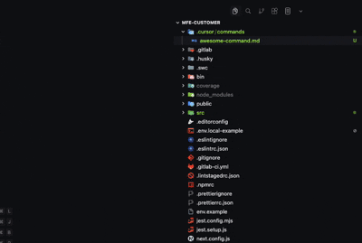
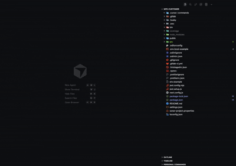
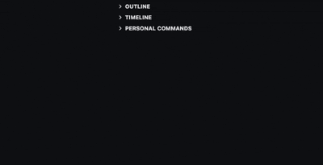

# Cursor Toys Extension 🤖 Your AI Coding Assistant

A VS Code/Cursor extension designed to **simplify and accelerate the sharing** of your custom Cursor configurations (commands, rules, and prompts) through easy-to-generate and easy-to-import deeplinks.

**Share your custom instructions, commands, and rules with your team or community in seconds\!**

## 🎬 Visual Demo

### Share Commands and Generate Deeplinks


### Import Commands, Rules, and Prompts


### Personal Commands Tree View


## Purpose: Simplified Collaboration and Sharing

This extension turns your Cursor configuration files into sharable assets, greatly enhancing **collaboration** and **knowledge replication**. It achieves this by:

  * **Generating Sharable Deeplinks:** Create a deeplink from your existing files with a single click, ready for distribution.
  * **Instant Import:** Paste a deeplink to **automatically create** the corresponding file in the correct directory (`.cursor/commands/`, `.cursor/rules/`, or `.cursor/prompts/`) on any machine.
  * **Maximum Compatibility:** Support for both deeplink formats (`cursor://`) and web link formats (`https://cursor.com/link/`) for various distribution methods.
  * **Direct Access:** CodeLens integration for quick link generation directly at the top of your files.

Deeplinks are the ideal tool to ensure everyone on your team uses the exact same AI commands, rules, and prompts, promoting **consistency** and **knowledge sharing**.

## ✨ What's New in v0.4.0

### Personal Commands Management


- **Tree View Interface**: New "Personal Commands" sidebar view to browse and manage your user commands from `~/.cursor/commands/` or `~/.claude/commands/`
- **Visual Command Management**: Manage personal commands directly from the tree view with actions to:
  - Open command files
  - Generate deeplinks for sharing
  - Rename commands
  - Delete commands
  - Reveal commands in Explorer
  - Refresh the tree view
- **Automatic Folder Creation**: Tree view automatically creates user commands folder if it doesn't exist
- **Smart Filtering**: Tree view filters files by allowed extensions from configuration
- **Alphabetical Sorting**: Commands are automatically sorted alphabetically for easy navigation

### Enhanced User Experience
- **Improved Organization**: Enhanced user commands management with visual tree view interface
- **Better Accessibility**: Dedicated sidebar view for personal commands makes them easily accessible across all projects

## Key Sharing Features

  * **Generate Share Links**: Right-click on any file within `.cursor/` or `.claude/commands/` to generate the deeplink (command, rule, or prompt) **copied directly to your clipboard**.
  * **Import for Replication**: Use the shortcut or command palette to instantly import a deeplink, **recreating the file for immediate use**.
  * **User Commands Support**: Save commands to `~/.cursor/commands` or `~/.claude/commands` (personal commands available across all projects) or project-specific folders.
  * **Claude Commands Compatibility**: Full support for `.claude/commands/` folder alongside `.cursor/commands/` - generate deeplinks and import commands to either folder based on configuration.
  * **Flexible Formats**: Choose between the native `cursor://` format or the `https://cursor.com/link/` web-redirect format.
  * **CodeLens for Quick Share**: Click the CodeLens link at the top of your file to quickly copy the share link.
  * **Size Validation**: Ensures your content fits within the 8,000 character URL limit after encoding, preventing sharing failures.
  * **Organized Context Menu**: All Cursor Commands Share commands are organized in a submenu for better UX.

## Installation

### Install via Store (Recommended)

- **VS Code Marketplace**: [Install from Visual Studio Code Marketplace](https://marketplace.visualstudio.com/items?itemName=Godrix.cursor-deeplink)
- **Open VSX (Cursor/other editors)**: [Install via Open VSX Registry](https://open-vsx.org/extension/godrix/cursor-deeplink)
- **Cursor Store**: Search for "Cursor Toys" directly inside Cursor's extension store

### Manual Install via VSIX

1. Go to the **[GitHub Releases page](https://github.com/godrix/cursor-deeplink/releases)** for this repository.
2. Download the latest `.vsix` file.
3. In VS Code or Cursor, open the Command Palette with `Ctrl+Shift+P` (Windows/Linux) or `Cmd+Shift+P` (Mac).
4. Run **"Extensions: Install from VSIX..."** and select the downloaded file.
5. The extension will install and be ready to use.

## 🤝 Usage: Share and Import

### Generating Share Links


#### Method 1: Context Menu (Recommended for Quick Generation)

1.  Navigate to the configuration file you wish to share:
      * `.cursor/commands/` or `.claude/commands/` (for Commands)
      * `.cursor/rules/` (for Rules)
      * `.cursor/prompts/` (for Prompts)
2.  **Right-click** the file and select the specific **"Generate Cursor Toys..."** option (e.g., "Generate Cursor Toys Command").
3.  The share link will be **automatically copied to your clipboard**.

#### Method 2: CodeLens (Direct In-File Access)

1.  Open any file in `.cursor/commands/`, `.claude/commands/`, `.cursor/rules/`, or `.cursor/prompts/`.
2.  Click the CodeLens link displayed at the top of the file.
3.  The deeplink will be generated and copied.

### Importing Shared Links


#### Method 1: Keyboard Shortcut

1.  Press **`Ctrl+Shift+I`** (Windows/Linux) or **`Cmd+Shift+I`** (Mac).
2.  Paste the deeplink into the input box.
3.  For **commands**, choose where to save:
    - **Project commands**: Save to `.cursor/commands/` or `.claude/commands/` in the current workspace (based on configuration, project-specific)
    - **Personal commands**: Save to `~/.cursor/commands/` or `~/.claude/commands/` (based on configuration, available in all projects)
4.  The file will be **automatically created and imported** into the appropriate directory.

#### Method 2: Command Palette

1.  Press `Cmd+Shift+P` (Mac) or `Ctrl+Shift+P` (Windows/Linux).
2.  Type **"Import Cursor Toys"**.
3.  Paste the deeplink, and for commands, choose the save location.
4.  The file will be created.

### Saving Commands as User Commands

You can move existing project commands to your personal commands folder so they're available across all projects:

1.  Right-click on any file in `.cursor/commands/` or `.claude/commands/` folder.
2.  Select **"Cursor Toys"** submenu.
3.  Choose **"Save as User Command"**.
4.  The command will be copied to `~/.cursor/commands/` or `~/.claude/commands/` (based on your configuration) and you'll be asked if you want to remove the original file from the workspace.

## 📐 Link Formats for Distribution

You can configure the extension to generate the format that best suits your distribution needs:

| Format | Example (for sharing) | Ideal Use Case |
| :--- | :--- | :--- |
| **Deeplink (Default)** | `cursor://anysphere.cursor-deeplink/prompt?text=...` | Direct sharing in communication tools that support native links. |
| **Web Link** | `https://cursor.com/link/prompt?text=...` | Distribution on blogs, forums, or platforms requiring a web redirect. |
| **Custom** | `https://example.com/link/prompt?text=...` | Use your own base URL for custom distribution or internal systems. |

## Configuration

Adjust settings to control the sharing format, allowed file types, and commands folder location.

  * **`cursorDeeplink.linkType`**: Defines whether to generate a `deeplink`, `web`, or `custom` link for sharing. (Default: `"deeplink"`)
  * **`cursorDeeplink.customBaseUrl`**: Custom base URL for deeplinks (only used when `linkType` is `"custom"`). Must be a valid URL starting with `http://`, `https://`, or a custom protocol. (Default: `""`)
  * **`cursorDeeplink.allowedExtensions`**: Allowed file extensions for link processing. (Default: `["md", "mdc"]`)
  * **`cursorDeeplink.commandsFolder`**: Choose which folder to use for commands: `"cursor"` for `.cursor/commands/` or `"claude"` for `.claude/commands/`. Only affects the `commands` folder; `rules` and `prompts` always use `.cursor/`. Supports both workspace and user-level settings. (Default: `"cursor"`)

### Example Configurations

#### Using Web Links
```json
{
  "cursorDeeplink.linkType": "web"
}
```

#### Using Custom Base URL
```json
{
  "cursorDeeplink.linkType": "custom",
  "cursorDeeplink.customBaseUrl": "https://example.com/link/"
}
```

#### Using Claude Commands Folder
```json
{
  "cursorDeeplink.commandsFolder": "claude"
}
```

This will make the extension save imported commands to `.claude/commands/` instead of `.cursor/commands/`. You can still generate deeplinks from both folders, but imports will go to the configured folder.

## Examples of Sharing in Action

### Example 1: Share a Custom Command

1.  Create the file `.cursor/commands/run-tests.md`.
2.  Generate and copy the deeplink (Method 1 or 2).
3.  **Share the link:** `cursor://anysphere.cursor-deeplink/command?name=run_tests&text=Run%20the%20tests%20in%20package.json`

### Example 2: Import a Shared Prompt

1.  A teammate shares a prompt deeplink.
2.  You press `Cmd+Shift+I` and paste the link.
3.  The prompt file is **automatically created** in `.cursor/prompts/`, ready for use.

### Example 3: Share a Rule with the Team

1.  Create the rule `.cursor/rules/code-review.mdc`.
2.  Generate the deeplink (in `web` format for maximum compatibility).
3.  **Share the web link** in a team channel.

-----

## Limitations (Relevant Sharing Information)

  * **Maximum URL Length**: The file content cannot exceed 8,000 characters (after URL-encoding) when converted into a link. The system will warn you if this limit is reached.
  * **File Location**: Only files within the `.cursor/commands/`, `.claude/commands/`, `.cursor/rules/`, or `.cursor/prompts/` folders can be converted into share links.

## Commands

| Command | Description (Focus on Sharing) | Shortcut |
| :--- | :--- | :--- |
| `cursor-toys.generate` | Generate share link (opens type selector) | - |
| `cursor-toys.generate-command` | Generate command share link | - |
| `cursor-toys.generate-rule` | Generate rule share link | - |
| `cursor-toys.generate-prompt` | Generate prompt share link | - |
| `cursor-toys.import` | **Import** share link to create file | `Ctrl+Shift+I` / `Cmd+Shift+I` |
| `cursor-toys.save-as-user-command` | Save project command as user command (available in all projects) | - |
| `cursor-toys.sendToChat` | Send custom text to Cursor chat | - |
| `cursor-toys.sendSelectionToChat` | Send selected code to Cursor chat | - |

-----

## Contributing and License

Contributions are welcome\! Please feel free to submit a Pull Request.

This project is licensed under the MIT License.